# ggsvelte

[](https://app.codecov.io/gh/ljodea/ggsvelte)

A layered grammar of graphics for Svelte 5. Map data to aesthetics, add geoms, then
compose statistics, scales, facets, coordinates, themes, and interaction.

[Documentation](https://ggsvelte.sh/) · [Examples](https://ggsvelte.sh/examples) ·
[Getting started](https://ggsvelte.sh/guide/getting-started) ·
[Playground](https://ggsvelte.sh/playground)

## Install

```sh
bun add @ggsvelte/svelte
# or: npm install @ggsvelte/svelte
```

Requires Node.js 22+ and Svelte 5.33.1+. npm, pnpm, and Bun installs are tested on
Ubuntu and Windows.

## Examples

Each image is generated from the Svelte file shown above it. Open a chart for the
live output and complete source.

### [Loess trend with uncertainty](https://ggsvelte.sh/examples/smooth/loess-scatter)

<!-- example-source: smooth/loess-scatter -->

```svelte
<script lang="ts">
  import { GeomPoint, GeomSmooth, GGPlot } from "@ggsvelte/svelte";

  import { trend } from "./data.js";
</script>

<GGPlot
  data={trend}
  aes={{ x: "dose", y: "effect" }}
  labs={{
    title: "Dose response with a loess trend",
    x: "Dose",
    y: "Effect",
  }}
  width={640}
  height={400}
>
  <GeomPoint alpha={0.55} size={2.5} />
  <GeomSmooth method="loess" span={0.75} />
</GGPlot>
```

[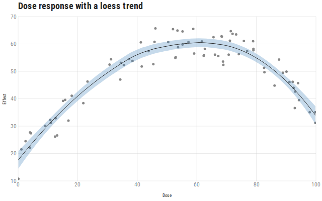](https://ggsvelte.sh/examples/smooth/loess-scatter)

### [Stacked area](https://ggsvelte.sh/examples/area/stacked)

<!-- example-source: area/stacked -->

```svelte
<script lang="ts">
  import { GeomArea, GGPlot } from "@ggsvelte/svelte";

  import { generation } from "./data.js";
</script>

<GGPlot
  data={generation}
  aes={{ x: "year", y: "twh", fill: "source" }}
  scales={{ x: { labels: "d", nice: false } }}
  labs={{
    title: "Electricity generation mix",
    x: "Year",
    y: "Generation (TWh)",
    fill: "Source",
  }}
  width={640}
  height={400}
>
  <GeomArea alpha={0.9} />
</GGPlot>
```

[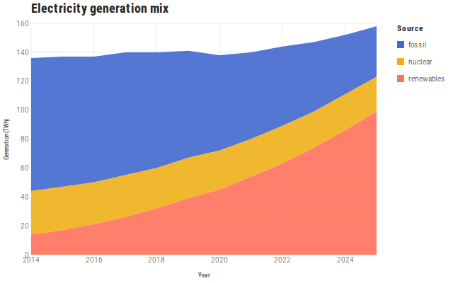](https://ggsvelte.sh/examples/area/stacked)

### [Density estimates](https://ggsvelte.sh/examples/density/overlay)

<!-- example-source: density/overlay -->

```svelte
<script lang="ts">
  import { GeomDensity, GGPlot } from "@ggsvelte/svelte";

  import { sessions } from "./data.js";
</script>

<GGPlot
  data={sessions}
  aes={{ x: "minutes", fill: "cohort" }}
  labs={{
    title: "Session length by cohort",
    x: "Session length (minutes)",
    y: "Density",
    fill: "Cohort",
  }}
  width={640}
  height={400}
>
  <GeomDensity alpha={0.45} />
</GGPlot>
```

[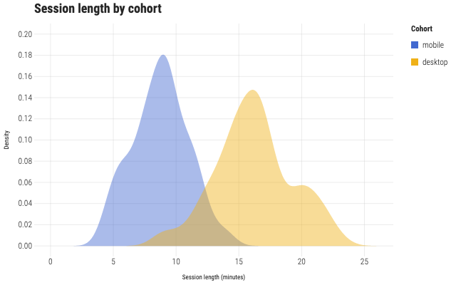](https://ggsvelte.sh/examples/density/overlay)

### [Log scale, fit, and inspection](https://ggsvelte.sh/examples/point/log-scale)

<!-- example-source: point/log-scale -->

```svelte
<script lang="ts">
  import { GeomPoint, GeomSmooth, GGPlot, scaleXLog10 } from "@ggsvelte/svelte";

  import { countries } from "./data.js";
</script>

<GGPlot
  data={countries}
  aes={{ x: "gdp", y: "lifeExp", color: "region" }}
  scales={scaleXLog10({ labels: "~s" })}
  key="country"
  inspect={{ mode: "xy", pin: true }}
  zoom={{ mode: "x" }}
  labs={{
    title: "Income and life expectancy",
    x: "GDP per capita (USD, log scale)",
    y: "Life expectancy (years)",
    color: "Region",
  }}
  width="container"
  height={400}
>
  <GeomPoint size={3.5} />
  <GeomSmooth method="lm" se={false} />
</GGPlot>
```

[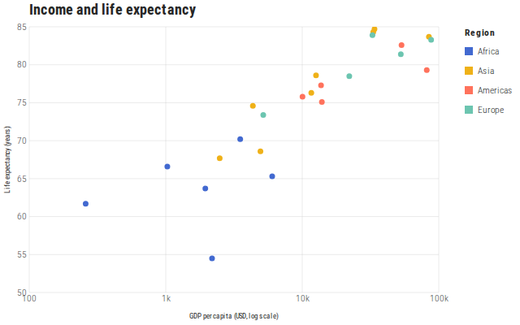](https://ggsvelte.sh/examples/point/log-scale)

### [Faceted histograms](https://ggsvelte.sh/examples/facet/wrap)

<!-- example-source: facet/wrap -->

```svelte
<script lang="ts">
  import { GeomHistogram, GGPlot } from "@ggsvelte/svelte";

  import { samples } from "./data.js";
</script>

<GGPlot
  data={samples}
  aes={{ x: "ms" }}
  facet={{ wrap: "service", ncol: 3 }}
  labs={{
    title: "Response time by service",
    x: "Response time (ms)",
    y: "Requests",
  }}
  width={640}
  height={400}
>
  <GeomHistogram bins={18} />
</GGPlot>
```

[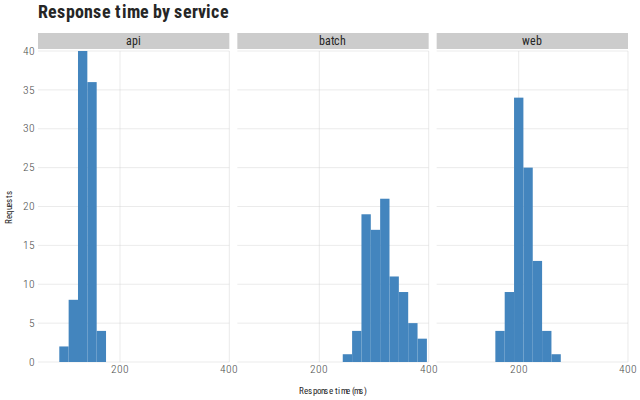](https://ggsvelte.sh/examples/facet/wrap)

### [Proportional bars](https://ggsvelte.sh/examples/bar/proportions)

<!-- example-source: bar/proportions -->

```svelte
<script lang="ts">
  import { GeomBar, GGPlot } from "@ggsvelte/svelte";

  import { sessions } from "./data.js";
</script>

<GGPlot
  data={sessions}
  aes={{ x: "age", fill: "genre" }}
  scales={{ y: { labels: ".0%" } }}
  legend={{ order: "sorted" }}
  labs={{
    title: "What each age group streams",
    x: "Age group",
    y: "Share of sessions",
    fill: "Genre",
  }}
  width={640}
  height={400}
>
  <GeomBar position="fill" />
</GGPlot>
```

[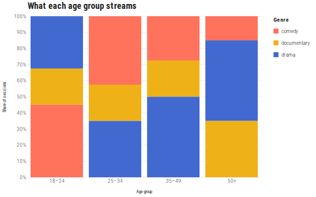](https://ggsvelte.sh/examples/bar/proportions)

### [Continuous color](https://ggsvelte.sh/examples/color/continuous)

<!-- example-source: color/continuous -->

```svelte
<script lang="ts">
  import { GeomPoint, GGPlot, scaleColorContinuous } from "@ggsvelte/svelte";

  import { stations } from "./data.js";
</script>

<GGPlot
  data={stations}
  aes={{ x: "elevation", y: "julyTemp", color: "elevation" }}
  scales={scaleColorContinuous({ scheme: "viridis" })}
  labs={{
    title: "It gets colder as you climb",
    x: "Elevation (m)",
    y: "July mean temperature (°C)",
    color: "Elevation (m)",
  }}
  width="container"
  height={400}
>
  <GeomPoint size={4} />
</GGPlot>
```

[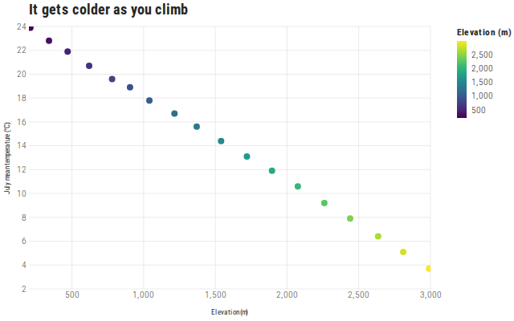](https://ggsvelte.sh/examples/color/continuous)

Guide presentation stays separate from scale math. Use `guides={{ color:
guideColorbar({ position: "bottom" }) }}` (or fluent `.guides()`) to title,
orient, place, suppress, or force axes and non-position guides. Automatic legends use
the right side only while at least 320px of panel remains, then move below with
complete accessible labels and unchanged scale assignments.

### [Boxplots](https://ggsvelte.sh/examples/boxplot/by-category)

<!-- example-source: boxplot/by-category -->

```svelte
<script lang="ts">
  import { GeomBoxplot, GGPlot } from "@ggsvelte/svelte";

  import { readings } from "./data.js";
</script>

<GGPlot
  data={readings}
  aes={{ x: "instrument", y: "value" }}
  labs={{
    title: "Reading spread by instrument",
    x: "Instrument",
    y: "Reading",
  }}
  width={640}
  height={400}
>
  <GeomBoxplot />
</GGPlot>
```

[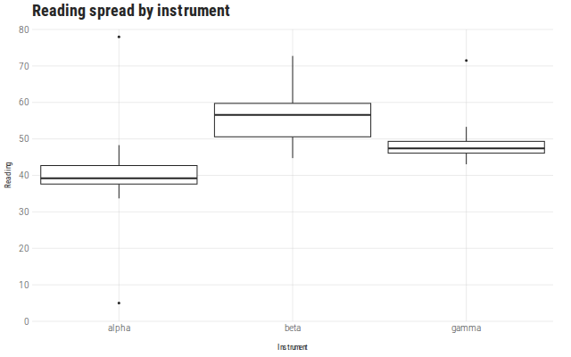](https://ggsvelte.sh/examples/boxplot/by-category)

### [Calendar time from raw years](https://ggsvelte.sh/examples/line/time-axis)

<!-- example-source: line/time-axis -->

```svelte
<script lang="ts">
  import { GeomLine, GGPlot } from "@ggsvelte/svelte";

  import { longRunSeries } from "./data.js";
</script>

<GGPlot
  data={longRunSeries}
  aes={{ x: "year", y: "value" }}
  labs={{
    title: "Long-run index, 1835–2025",
    subtitle: "Raw four-digit strings infer a calendar scale",
    x: "Year",
    y: "Index",
  }}
  width="container"
  height={400}
>
  <GeomLine linewidth={1.5} />
</GGPlot>
```

[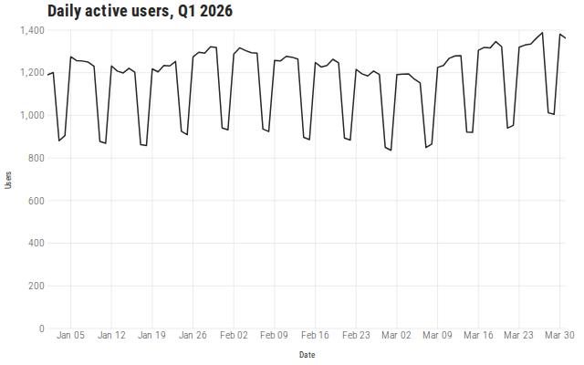](https://ggsvelte.sh/examples/line/time-axis)

### [Layered value labels](https://ggsvelte.sh/examples/col/value-labels)

<!-- example-source: col/value-labels -->

```svelte
<script lang="ts">
  import { GeomCol, GeomText, GGPlot } from "@ggsvelte/svelte";

  import { revenue } from "./data.js";
</script>

<GGPlot
  data={revenue}
  aes={{ x: "quarter", y: "amount" }}
  labs={{
    title: "Quarterly revenue",
    x: "Quarter",
    y: "Revenue (€ thousands)",
  }}
  width={640}
  height={400}
>
  <GeomCol width={0.7} />
  <GeomText aes={{ label: "label" }} dy={-8} size={11} />
</GGPlot>
```

[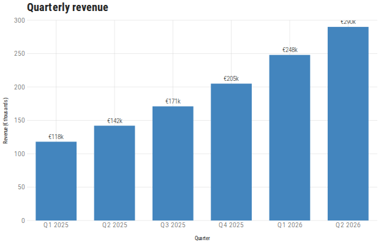](https://ggsvelte.sh/examples/col/value-labels)

## Themes

Chart themes are independent of the site's light or dark appearance. The same spec can
use a built-in theme or explicit theme tokens.

|                                                           Tufte                                                           |                                                             Economist                                                             |
| :-----------------------------------------------------------------------------------------------------------------------: | :-------------------------------------------------------------------------------------------------------------------------------: |
| [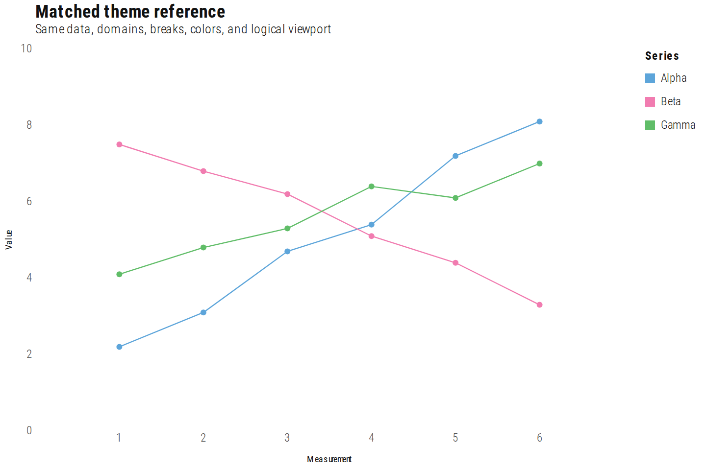](https://ggsvelte.sh/themes) | [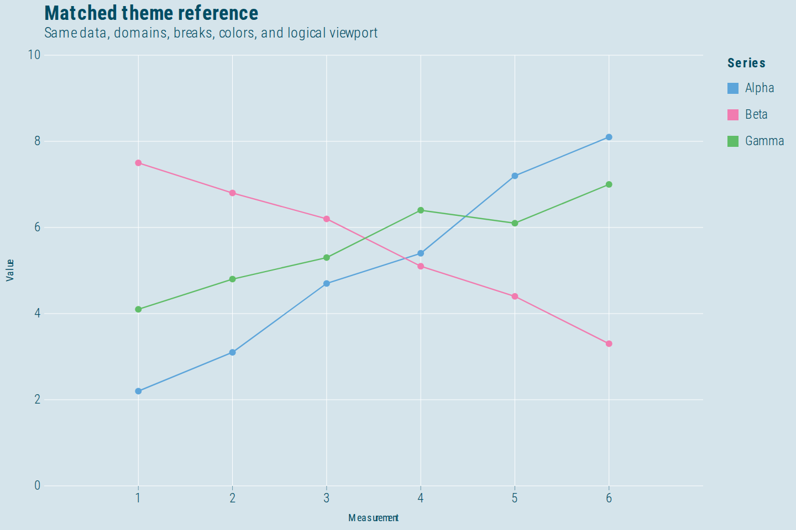](https://ggsvelte.sh/themes) |
|                                                           HRBR                                                            |                                                               Dark                                                                |
|  [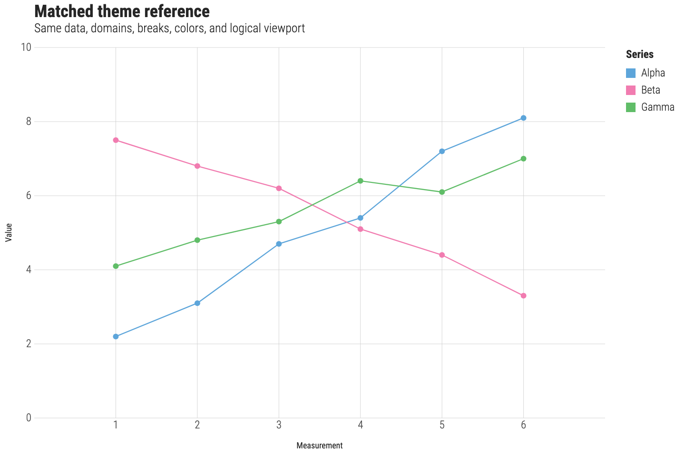](https://ggsvelte.sh/themes)  |      [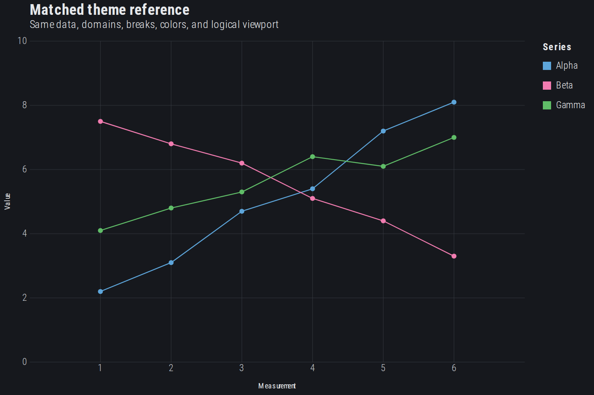](https://ggsvelte.sh/themes)      |

[Compare every theme and palette](https://ggsvelte.sh/themes).

## Composition

- Geoms share one layer model, so points, lines, intervals, summaries, annotations,
  and text can occupy the same plot.
- Statistics and positions include binning, density, loess and linear fits, stacking,
  filling, dodging, and seeded jitter.
- Scales cover continuous, discrete, temporal, binned, transformed, color/fill, size, linewidth, alpha, shape, and linetype data.
- Facets train fixed or free panel scales; coordinates can flip axes or project final geometry after statistics.
- Inspection, selection, zoom, and legend controls emit semantic Svelte events.
- Ordinary layers render as SVG. Dense point layers move to canvas while axes, text,
  legends, and accessible descriptions remain in the DOM.

## Packages

| Package                               | Surface                                                                 |
| ------------------------------------- | ----------------------------------------------------------------------- |
| [`@ggsvelte/svelte`](packages/svelte) | Svelte 5 components, package re-exports, and the CLI                    |
| [`@ggsvelte/spec`](packages/spec)     | Portable types, JSON Schema, validation, normalization, and the builder |
| [`@ggsvelte/core`](packages/core)     | Framework-independent pipeline, SVG renderer, canvas, and hit testing   |

Most applications need only `@ggsvelte/svelte`.

## Reference

- [Guide](https://ggsvelte.sh/docs)
- [Example gallery](https://ggsvelte.sh/examples)
- [Themes and palettes](https://ggsvelte.sh/themes)
- [Interactions and events](https://ggsvelte.sh/reference/interactions)
- [Compatibility](https://ggsvelte.sh/guide/compatibility)
- [Upgrading](https://ggsvelte.sh/guide/upgrading)

Machine-readable documentation is available at
[`llms.txt`](https://ggsvelte.sh/llms.txt),
[`llms-full.txt`](https://ggsvelte.sh/llms-full.txt), and
[`schema/v0.json`](https://ggsvelte.sh/schema/v0.json).

## Release status

ggsvelte remains pre-1.0. Package manifests are the version source of truth. Lifecycle
and compatibility contracts are documented in
[`lifecycle.json`](lifecycle.json) and the
[lifecycle guide](https://ggsvelte.sh/guide/lifecycle).

## Contributing

See [CONTRIBUTING.md](CONTRIBUTING.md).

## License

[MIT](LICENSE) © Liam O'Dea. Loess reference implementation attribution is recorded in
[NOTICE](NOTICE).
