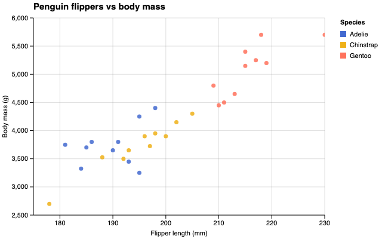
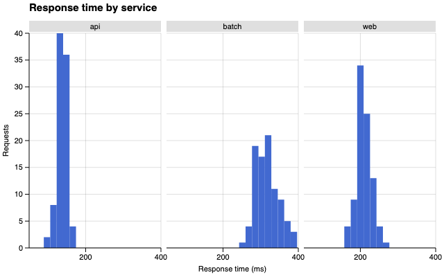
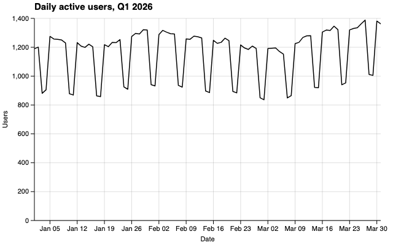

# ggsvelte

[](https://app.codecov.io/gh/ljodea/ggsvelte)

A layered grammar of graphics for JavaScript — ggplot2 semantics (aes, geom,
stat, scale, coord, facet, theme, position), a strictly-JSON spec at the
center, Svelte 5 runes-native components, and hybrid SVG/canvas rendering.

Build polished charts from Svelte components, a fluent builder, or portable
JSON. ggsvelte gives you readable scales, stable colors, contained responsive
rendering, and publication-ready themes before you tune anything.

> **Status: the package manifests are the version source of truth; current releases remain pre-1.0.** Correctness fixes may
> improve default semantics in place; behavioral changes and direct overrides are
> documented rather than preserved behind legacy runtime branches. Every export carries a
> lifecycle tag (see `lifecycle.json` and the docs lifecycle page).

## What you can make

|                                               Categorical scatter                                               |                                         Loess trend with uncertainty                                         |
| :-------------------------------------------------------------------------------------------------------------: | :----------------------------------------------------------------------------------------------------------: |
|  |  |
|                                            **Faceted distributions**                                            |                                               **Time series**                                                |
|                                |              |

## Install

```sh
bun add @ggsvelte/svelte        # or: npm install @ggsvelte/svelte
```

`@ggsvelte/svelte` pulls in `@ggsvelte/spec` (spec types, validation, builder) and
`@ggsvelte/core` (pipeline + renderers) and re-exports the whole surface.

Requires Node.js 22+ and Svelte 5.33.1+. Clean packed-artifact installs are
tested with npm, pnpm, and Bun on Ubuntu and Windows; see the
[compatibility matrix](https://ljodea.github.io/ggsvelte/guide/compatibility).

## Why ggsvelte

- **Good defaults without hidden rules** — readable axes, restrained themes,
  sensible inferred scales, and stable categorical colors. Valid but
  questionable choices produce actionable advisories instead of visual
  footguns.
- **Charts stay inside their container** — omitted width is responsive by
  default; a numeric width is the explicit fixed-size opt-in. The plot surface
  clips marks and keeps overlays bounded.
- **Defaults can improve safely** — every spec is stamped with an edition, so
  future improvements do not silently restyle existing charts.
- **Use the right renderer for the data** — SVG for axes, text, and ordinary
  layers; canvas automatically above 2,000 marks; deterministic SVG for export.
- **A real grammar, not a chart-type menu** — 12+ geoms, R-fixture-tested
  statistics, positions, free-scale facets, coordinates, annotations, and
  interaction compose through the same model.
- **Interaction is semantic and opt-in** — inspect and pin data, select points
  or intervals, brush to zoom, and consume typed Svelte 5 events without
  depending on SVG nodes or renderer indices.

Try [inspection and pinning](https://ljodea.github.io/ggsvelte/examples/interaction/tooltip)
or [interval selection and zoom](https://ljodea.github.io/ggsvelte/examples/interaction/brush-zoom),
then [filter groups without losing their colors](https://ljodea.github.io/ggsvelte/examples/interaction/legend-filter)
or [coordinate intervals across facets](https://ljodea.github.io/ggsvelte/examples/interaction/facet-intervals),
adapt a [bounded PortableSpec in the local playground](https://ljodea.github.io/ggsvelte/playground),
then read the [interaction guide](https://ljodea.github.io/ggsvelte/guide/interactions)
or [searchable event reference](https://ljodea.github.io/ggsvelte/reference/interactions).

## Dates without preprocessing

A raw four-digit string column is enough to get a proportional calendar axis. No index
mapping, ISO conversion, or explicit time scale is required:

```svelte
<script lang="ts">
  import { GGPlot, GeomLine } from "@ggsvelte/svelte";

  const rows = [
    { year: "1835", value: 12 },
    { year: "1900", value: 19 },
    { year: "2026", value: 31 },
  ];
</script>

<GGPlot
  data={rows}
  aes={{ x: "year", y: "value" }}
  width="container"
  height={360}
>
  <GeomLine />
</GGPlot>
```

Strict ISO dates, year-months, year-quarters, and runtime `Date` values work the same way.
Ambiguous ordered dates stay discrete until you choose an order:

```ts
const spec = gg(rows, aes({ x: "when", y: "value" }))
  .geomLine()
  .scaleXDate({ parse: "dmy" })
  .spec();
```

Portable JSON uses `scales: { x: { type: "time", parse: "dmy" } }`. If four-digit
values are identifiers rather than years, use `.scaleXDiscrete()` or
`scales: { x: { type: "band" } }`. Inspect `model.scaleDecisions` and
`model.scaleDiagnostics` through `onrender` to see the bounded evidence and copyable
correction.

## One spec, three surfaces

**Spec JSON** (what agents emit; JSON Schema at `packages/spec/schema/v0.json`):

```svelte
<script>
  import { GGPlot } from "@ggsvelte/svelte";

  const spec = {
    data: {
      values: [
        { displ: 1.8, hwy: 29 },
        { displ: 5.7, hwy: 16 },
      ],
    },
    layers: [
      { geom: "point", aes: { x: { field: "displ" }, y: { field: "hwy" } } },
    ],
  };
</script>

<GGPlot {spec} width={640} height={400} />
```

**Fluent builder**:

```ts
import { aes, gg } from "@ggsvelte/svelte";

const spec = gg(rows, aes({ x: "displ", y: "hwy" }))
  .geomPoint()
  .spec();
```

**Svelte components**:

```svelte
<GGPlot data={rows} aes={{ x: "displ", y: "hwy" }} width={640} height={400}>
  <GeomPoint />
</GGPlot>
```

Headless (Node/edge/workers, no DOM):

```ts
import { renderToSVGString } from "@ggsvelte/core";
const svg = renderToSVGString(spec, { width: 640, height: 400 });
```

CLI: `ggsvelte-render spec.json > chart.svg` (JSON-line diagnostics on stderr).

## Packages

| Package                               | What                                                                                            |
| ------------------------------------- | ----------------------------------------------------------------------------------------------- |
| [`@ggsvelte/svelte`](packages/svelte) | Svelte 5 components + everything re-exported + the CLI                                          |
| [`@ggsvelte/spec`](packages/spec)     | Spec types, JSON Schema, `normalize()`, `validate()`, `lintSpec()`, builder — zero DOM, zero d3 |
| [`@ggsvelte/core`](packages/core)     | Framework-agnostic pipeline + SVG renderer (pure entry) and canvas/hit-index (`/dom` entry)     |

## Agents

- Skill: [`skills/ggsvelte/SKILL.md`](skills/ggsvelte/SKILL.md) (also shipped
  inside the `@ggsvelte/svelte` package).
- Docs site endpoints: `/llms.txt`, `/llms-full.txt`, `/schema/v0.json`.
- Held-out eval harness: `tests/evals/` (`bun run evals`, dry-run without a key).

## Documentation

- [Guide and examples](https://ljodea.github.io/ggsvelte/)
- [Interactions and event reference](https://ljodea.github.io/ggsvelte/guide/interactions)
- [Local PortableSpec playground](https://ljodea.github.io/ggsvelte/playground)
- [Upgrading between releases](https://ljodea.github.io/ggsvelte/guide/upgrading)
- [Pre-0.1 interaction migration](https://ljodea.github.io/ggsvelte/guide/migrating-pre-0-1)
- [Lifecycle and editions](https://ljodea.github.io/ggsvelte/guide/lifecycle)

## Contributing

See [CONTRIBUTING.md](CONTRIBUTING.md) — tool roster (bun, oxlint+tsgolint,
pre-commit), the visual-regression trust model, decision records
(`docs/decisions/`), and the no-time-estimates rule.

## License

[MIT](LICENSE) © Liam O'Dea. Loess reference implementation attribution: see
[NOTICE](NOTICE).
