# ggsvelte

[](https://app.codecov.io/gh/ljodea/ggsvelte)

ggplot2's layered grammar for Svelte 5. Author with components; agents emit the
same chart as PortableSpec JSON — validate, apply the fix, render headless.
`@ggsvelte/svelte` ships the agent skill at
[`skills/ggsvelte`](skills/ggsvelte/SKILL.md).

[Documentation](https://ggsvelte.sh/) · [Examples](https://ggsvelte.sh/examples) ·
[Getting started](https://ggsvelte.sh/guide/getting-started)

## Install

```sh
bun add @ggsvelte/svelte
# or: npm install @ggsvelte/svelte
```

Requires Node.js 22+ and Svelte 5.33.1+. CI covers npm, pnpm, and Bun on Ubuntu
and Windows.

## Agents

- Skill: [`skills/ggsvelte/SKILL.md`](skills/ggsvelte/SKILL.md) (also published
  under `node_modules/@ggsvelte/svelte/skills/ggsvelte/`)
- Schema: [`schema/v0.json`](https://ggsvelte.sh/schema/v0.json)
- Corpus: [`llms.txt`](https://ggsvelte.sh/llms.txt) ·
  [`llms-full.txt`](https://ggsvelte.sh/llms-full.txt)
- `validate()` errors are `{ code, path, message, fix }` with a
  machine-applicable `fix.example`

## Examples

### [Loess trend with uncertainty](https://ggsvelte.sh/examples/smooth/loess-scatter)

<!-- example-source: smooth/loess-scatter -->

```svelte
<script lang="ts">
  import {
    GeomPoint,
    GeomSmooth,
    GGPlot,
    Labs,
    ScaleSizeContinuous,
    ScaleXContinuous,
    ThemeTufte,
  } from "@ggsvelte/svelte";

  import { gammaVirginis } from "./data.js";
</script>

<GGPlot
  data={gammaVirginis}
  aes={{ x: "year", y: "angle" }}
  width={640}
  height={400}
>
  <ThemeTufte />
  <ScaleXContinuous labels="d" />
  <ScaleSizeContinuous range={[3, 8]} />
  <Labs
    title="The first scatterplot, redrawn"
    subtitle="Herschel plotted γ Virginis in 1833 and fitted the curve by hand"
    x="Year"
    y="Position angle (°)"
    size="Herschel's weight"
  />
  <GeomSmooth method="loess" span={0.75} />
  <GeomPoint aes={{ size: "weight" }} alpha={0.85} />
</GGPlot>
```

[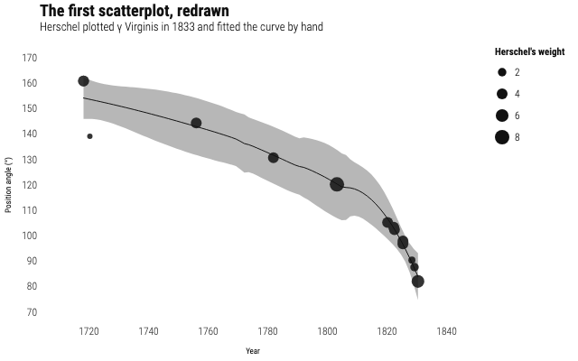](https://ggsvelte.sh/examples/smooth/loess-scatter)

### [Stacked area](https://ggsvelte.sh/examples/area/stacked)

<!-- example-source: area/stacked -->

```svelte
<script lang="ts">
  import {
    createPlotInteraction,
    GeomArea,
    GGPlot,
    GuideLegend,
    Labs,
    ScaleFillManual,
    ScaleXDate,
    ThemeEconomist,
  } from "@ggsvelte/svelte";

  import { crimeanMortality } from "./data.js";

  const interaction = createPlotInteraction({
    identity: (row) => `${row.month}:${row.cause}`,
  });
  const scope = { keys: "crimean-rows" } as const;
</script>

<GGPlot
  data={crimeanMortality}
  aes={{ x: "month", y: "deaths", fill: "cause" }}
  {interaction}
  interactionScope={scope}
  width={640}
  height={400}
>
  <ThemeEconomist />
  <ScaleXDate labels="%b %Y" />
  <ScaleFillManual
    domain={["Disease", "Wounds", "Other"]}
    values={["#d14d41", "#014d64", "#4385be"]}
  />
  <Labs
    title="Deaths in the Crimea, 1854–56"
    subtitle="Annual rate per 1,000 — disease dwarfs combat, then collapses"
    x="Month"
    y="Deaths per 1,000 per year"
    fill="Cause"
  />
  <GuideLegend channel="fill" focus />
  <GeomArea alpha={0.9} />
</GGPlot>
```

[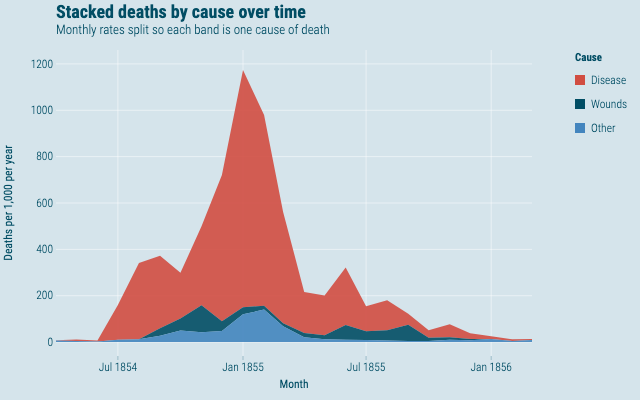](https://ggsvelte.sh/examples/area/stacked)

### [Density estimates](https://ggsvelte.sh/examples/density/overlay)

<!-- example-source: density/overlay -->

```svelte
<script lang="ts">
  import {
    GeomDensity,
    GGPlot,
    Labs,
    ScaleFillManual,
    ThemeMinimal,
  } from "@ggsvelte/svelte";

  import { galtonChildren } from "./data.js";
</script>

<GGPlot
  data={galtonChildren}
  aes={{ x: "height", fill: "gender" }}
  width={640}
  height={400}
>
  <ThemeMinimal />
  <ScaleFillManual
    domain={["Daughters", "Sons"]}
    values={["#8b7ec8", "#3aa99f"]}
  />
  <Labs
    title="Heights of Galton's 934 adult children"
    subtitle="Two overlapping distributions, separated at the means"
    x="Height (inches)"
    y="Density"
    fill="Child"
  />
  <GeomDensity alpha={0.45} />
</GGPlot>
```

[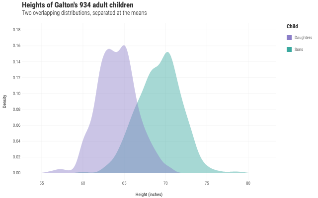](https://ggsvelte.sh/examples/density/overlay)

### [Log scale and inspection](https://ggsvelte.sh/examples/point/log-scale)

<!-- example-source: point/log-scale -->

```svelte
<script lang="ts">
  import {
    GeomPoint,
    GGPlot,
    GuideLegend,
    Inspect,
    Labs,
    ScaleColorManual,
    ScaleXLog10,
    ThemeEconomist,
  } from "@ggsvelte/svelte";

  import { londonCholera } from "./data.js";
</script>

<GGPlot
  data={londonCholera}
  aes={{ x: "density", y: "deathRate", color: "water" }}
  width="container"
  height={400}
>
  <Inspect mode="xy" pin identity="district" />
  <ThemeEconomist />
  <ScaleXLog10 labels="~s" />
  <ScaleColorManual
    domain={["Battersea", "New River", "Kew"]}
    values={["#d14d41", "#014d64", "#4385be"]}
  />
  <Labs
    title="Cholera, crowding and water in London, 1849"
    subtitle="Death rate against population density, by water company"
    x="People per acre (log scale)"
    y="Cholera deaths per 10,000"
    color="Water supply"
  />
  <GuideLegend channel="color" focus />
  <GeomPoint size={3.5} />
</GGPlot>
```

[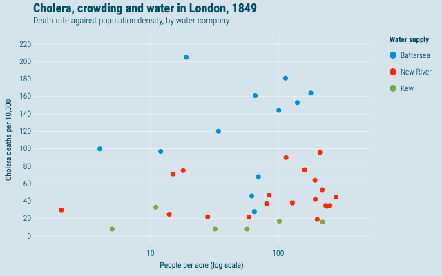](https://ggsvelte.sh/examples/point/log-scale)

### [Faceted histograms](https://ggsvelte.sh/examples/facet/wrap)

<!-- example-source: facet/wrap -->

```svelte
<script lang="ts">
  import {
    FacetWrap,
    GeomHistogram,
    GGPlot,
    Labs,
    ThemeGgplot2,
  } from "@ggsvelte/svelte";

  import { familyHeights } from "./data.js";
</script>

<GGPlot
  data={familyHeights}
  aes={{ x: "child", weight: "n" }}
  width={640}
  height={400}
>
  <ThemeGgplot2 />
  <FacetWrap field="pair" ncol={2} />
  <Labs
    title="4,892 English children, measured by Pearson and Lee"
    subtitle="Sons stand four and a half inches taller; the two daughter panels are the same girls, tabulated against each parent"
    x="Child's height (inches)"
    y="Children"
  />
  <GeomHistogram bins={18} />
</GGPlot>
```

[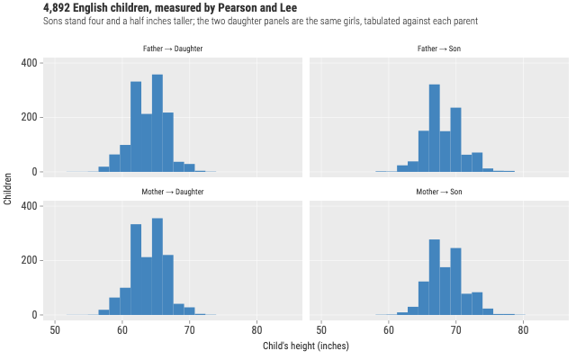](https://ggsvelte.sh/examples/facet/wrap)

### [Proportional bars](https://ggsvelte.sh/examples/bar/proportions)

<!-- example-source: bar/proportions -->

```svelte
<script lang="ts">
  import {
    GeomBar,
    GGPlot,
    Labs,
    ScaleFillManual,
    ScaleYContinuous,
    ThemeFivethirtyeight,
  } from "@ggsvelte/svelte";

  import { armadaCrews } from "./data.js";
</script>

<GGPlot
  data={armadaCrews}
  aes={{ x: "squadron", fill: "role", weight: "men" }}
  width={640}
  height={400}
>
  <ThemeFivethirtyeight />
  <ScaleYContinuous labels=".0%" />
  <ScaleFillManual
    domain={["Soldiers", "Sailors"]}
    values={["#c14a3d", "#3c6e8f"]}
  />
  <Labs
    title="Who sailed with the Armada, 1588"
    subtitle="Soldiers outnumber sailors everywhere except the galleys and the light pataches"
    x="Squadron"
    y="Share of complement"
    fill="Role"
  />
  <GeomBar position="fill" />
</GGPlot>
```

[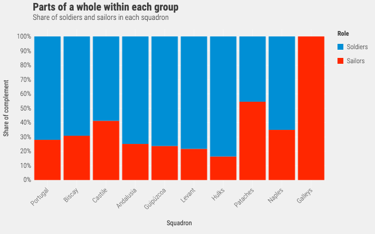](https://ggsvelte.sh/examples/bar/proportions)

### [Continuous color](https://ggsvelte.sh/examples/color/continuous)

<!-- example-source: color/continuous -->

```svelte
<script lang="ts">
  import {
    CoordFixed,
    GeomPoint,
    GGPlot,
    Labs,
    ScaleColorContinuous,
    ThemeDark,
  } from "@ggsvelte/svelte";

  import { greatLakesSurveys, greatLakesTruth } from "./data.js";
</script>

<GGPlot
  data={greatLakesSurveys}
  aes={{ x: "long", y: "lat", color: "year" }}
  width={640}
  height={400}
>
  <ThemeDark />
  <CoordFixed />
  <ScaleColorContinuous scheme="viridis" labels="d" />
  <Labs
    title="Eleven maps of the Great Lakes, 1688–1818"
    subtitle="White crosses are the 39 true positions; each dot is one map's attempt at one of them"
    x="Longitude (°)"
    y="Latitude (°)"
    color="Map year"
  />
  <GeomPoint size={2.6} alpha={0.75} />
  <GeomPoint
    data={greatLakesTruth}
    aes={{ x: "long", y: "lat", color: { value: "#ffffff" } }}
    size={3.4}
    shape="cross"
  />
</GGPlot>
```

[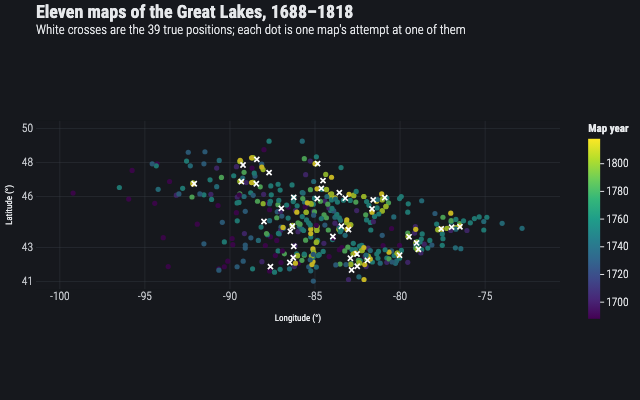](https://ggsvelte.sh/examples/color/continuous)

Guides are separate from scale math:
`<GuideColorbar channel="color" position="bottom" />`,
`<GuideLegend channel="color" position="bottom" />`,
`<GuideNone channel="size" />`. Auto non-position guides sit on the right while
≥320px of panel remains, then move below; scale assignments stay fixed.

### [Boxplots](https://ggsvelte.sh/examples/boxplot/by-category)

<!-- example-source: boxplot/by-category -->

```svelte
<script lang="ts">
  import {
    GeomBoxplot,
    GGPlot,
    Labs,
    ScaleXDiscrete,
    ThemeFew,
  } from "@ggsvelte/svelte";

  import { michelsonRuns } from "./data.js";
</script>

<GGPlot
  data={michelsonRuns}
  aes={{ x: "run", y: "velocity" }}
  width={640}
  height={400}
>
  <ThemeFew />
  <ScaleXDiscrete domain={["Jun 5", "Jun 7", "Jun 9", "Jun 12", "Jul 2"]} />
  <Labs
    title="Michelson's five runs, 1879"
    subtitle="Twenty measurements each — the runs disagree more than the readings within them"
    x="Run"
    y="Velocity (km/s − 299,000)"
  />
  <GeomBoxplot />
</GGPlot>
```

[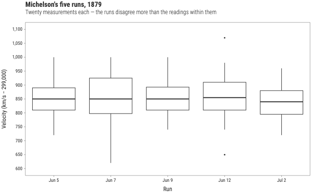](https://ggsvelte.sh/examples/boxplot/by-category)

### [Calendar time from raw years](https://ggsvelte.sh/examples/line/time-axis)

<!-- example-source: line/time-axis -->

```svelte
<script lang="ts">
  import {
    GeomLine,
    GGPlot,
    Labs,
    ThemeFivethirtyeight,
  } from "@ggsvelte/svelte";

  import { britishExports } from "./data.js";
</script>

<GGPlot
  data={britishExports}
  aes={{ x: "year", y: "value" }}
  width="container"
  height={400}
>
  <ThemeFivethirtyeight />
  <Labs
    title="British and Irish exports, 1855–1899"
    subtitle="Raw four-digit strings infer a calendar scale"
    x="Year"
    y="£ millions"
  />
  <GeomLine linewidth={1.5} />
</GGPlot>
```

[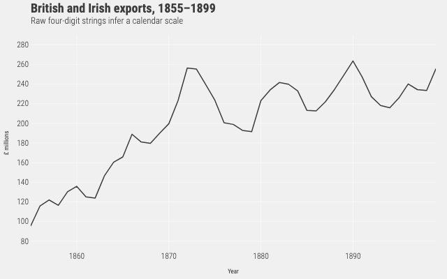](https://ggsvelte.sh/examples/line/time-axis)

### [Layered value labels](https://ggsvelte.sh/examples/col/value-labels)

<!-- example-source: col/value-labels -->

```svelte
<script lang="ts">
  import {
    GeomCol,
    GeomText,
    GGPlot,
    Labs,
    ScaleXDiscrete,
    ThemeFivethirtyeight,
  } from "@ggsvelte/svelte";

  import { polioTrial } from "./data.js";
</script>

<GGPlot
  data={polioTrial}
  aes={{ x: "group", y: "rate" }}
  width={640}
  height={400}
>
  <ThemeFivethirtyeight />
  <ScaleXDiscrete domain={["Vaccinated", "Placebo", "Not inoculated"]} />
  <Labs
    title="The Salk vaccine field trial, 1954"
    subtitle="Paralytic polio per 100,000 children in the randomised arm"
    x="Group"
    y="Cases per 100,000"
  />
  <GeomCol width={0.7} />
  <GeomText aes={{ label: "label" }} dy={-8} />
</GGPlot>
```

[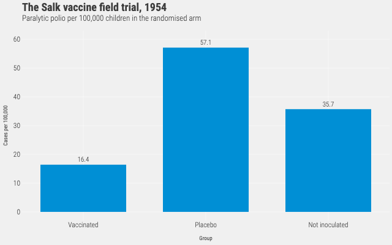](https://ggsvelte.sh/examples/col/value-labels)

## Themes

Plot theme tokens are independent of site light/dark.

|                                                           Tufte                                                           |                                                             Economist                                                             |
| :-----------------------------------------------------------------------------------------------------------------------: | :-------------------------------------------------------------------------------------------------------------------------------: |
| [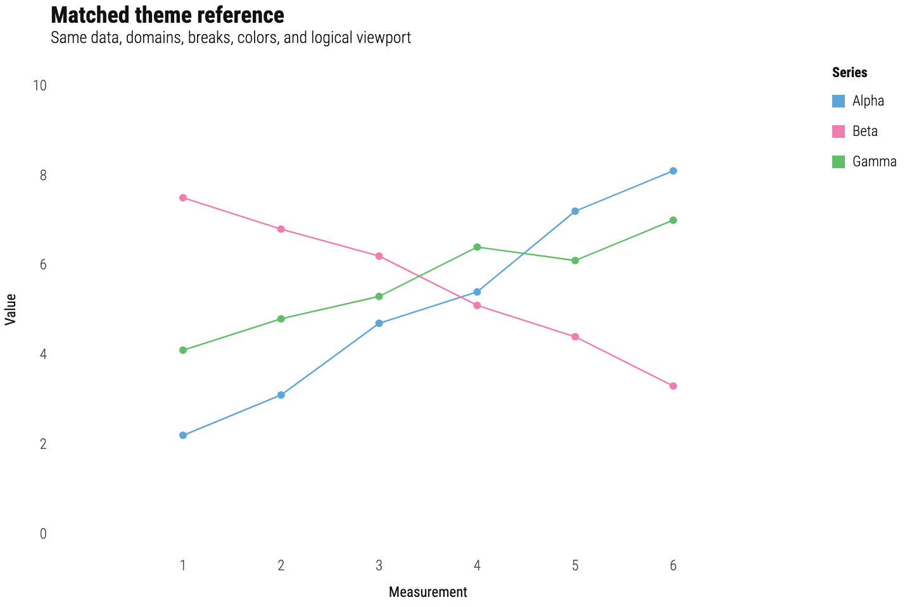](https://ggsvelte.sh/themes) | [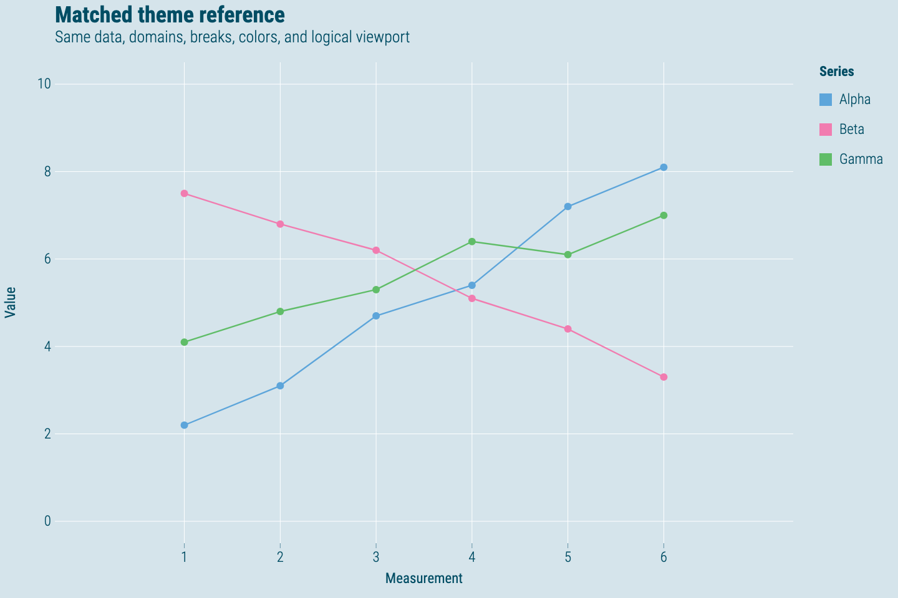](https://ggsvelte.sh/themes) |
|                                                           HRBR                                                            |                                                               Dark                                                                |
|  [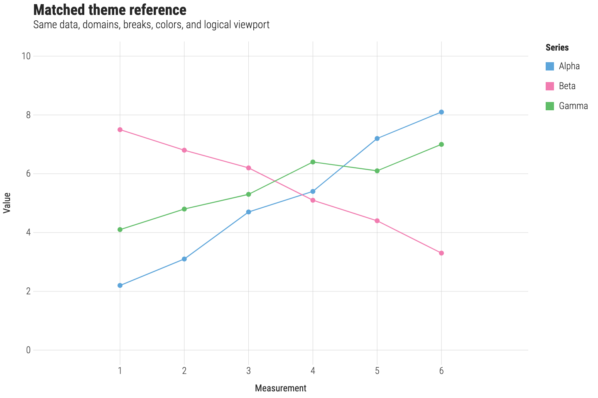](https://ggsvelte.sh/themes)  |      [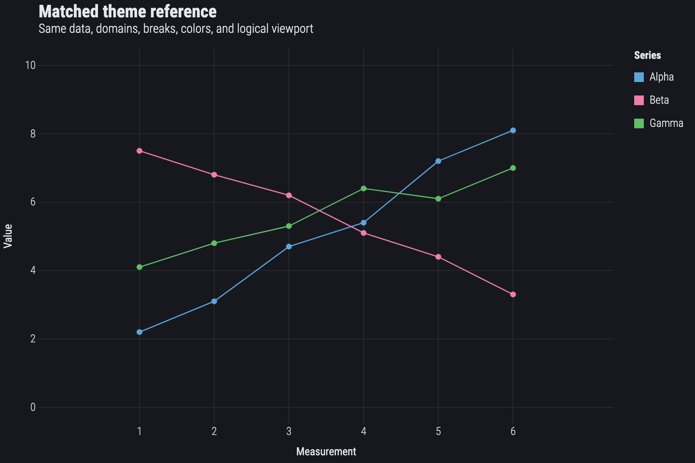](https://ggsvelte.sh/themes)      |

[Compare every theme and palette](https://ggsvelte.sh/themes).

## Packages

| Package                               | Surface                                                             |
| ------------------------------------- | ------------------------------------------------------------------- |
| [`@ggsvelte/svelte`](packages/svelte) | Svelte 5 components, re-exports, CLI, agent skill                   |
| [`@ggsvelte/spec`](packages/spec)     | PortableSpec types, JSON Schema, validate/normalize, fluent builder |
| [`@ggsvelte/core`](packages/core)     | Pipeline, headless SVG, canvas, hit testing                         |

## Reference

- [Guide](https://ggsvelte.sh/docs)
- [Example gallery](https://ggsvelte.sh/examples)
- [Themes and palettes](https://ggsvelte.sh/themes)
- [Interactions and events](https://ggsvelte.sh/reference/interactions)
- [Production](https://ggsvelte.sh/guide/production)
- [Upgrading](https://ggsvelte.sh/guide/upgrading)

## Release status

Pre-1.0. Package manifests are the version source of truth. Lifecycle and
compatibility contracts live in [`lifecycle.json`](lifecycle.json) and the
[lifecycle guide](https://ggsvelte.sh/guide/lifecycle).

## Contributing

See [CONTRIBUTING.md](CONTRIBUTING.md).

## License

[MIT](LICENSE) © Liam O'Dea. Loess reference attribution is in [NOTICE](NOTICE).
