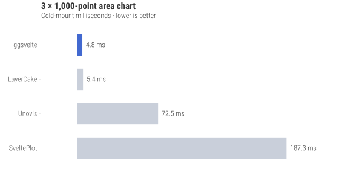
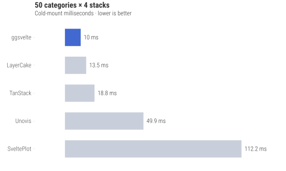
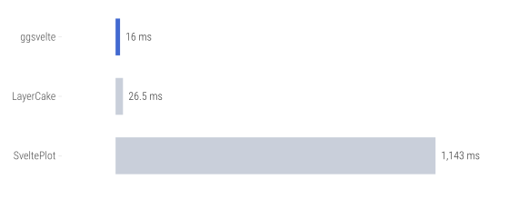
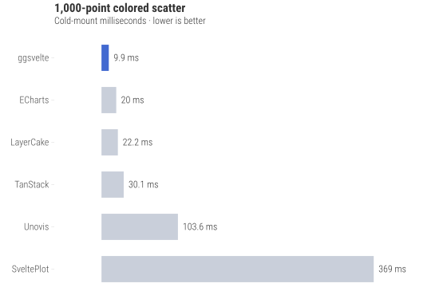
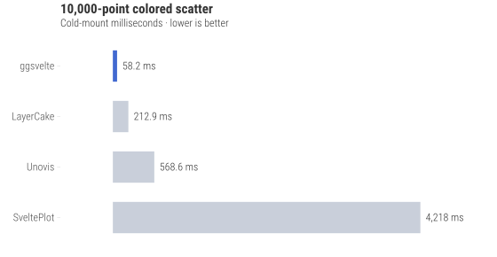

# ggsvelte

[](https://github.com/ljodea/ggsvelte/actions/workflows/ci.yml)
[](https://www.npmjs.com/package/@ggsvelte/svelte)
[](https://app.codecov.io/gh/ljodea/ggsvelte)
[](LICENSE)

ggsvelte is a fast agent-native implementation of the layered grammar of
graphics, inspired by ggplot2.

[Documentation](https://ggsvelte.sh/) · [Examples](https://ggsvelte.sh/examples) ·
[Getting started](https://ggsvelte.sh/guide/getting-started)











## Install

```sh
bun add @ggsvelte/svelte
# or: npm install @ggsvelte/svelte
```

Requires Node.js 22+ and Svelte 5.33.1+. CI covers npm, pnpm, and Bun on Ubuntu
and Windows.

## Agents

- Skill: [`@ggsvelte/skill`](packages/skill) — install from npm, then copy
  `node_modules/@ggsvelte/skill` into your agent's skills dir as `ggsvelte/`
  (dependabot surfaces version bumps for bundled copies). In-tree source:
  [`packages/skill/SKILL.md`](packages/skill/SKILL.md)
- Schema: [`schema/v0.json`](https://ggsvelte.sh/schema/v0.json)
- Corpus: [`llms.txt`](https://ggsvelte.sh/llms.txt) ·
  [`llms-full.txt`](https://ggsvelte.sh/llms-full.txt)
- `validate()` errors are `{ code, path, message, fix }` with a
  machine-applicable `fix.example`

## Packages

| Package                               | Surface                                                             |
| ------------------------------------- | ------------------------------------------------------------------- |
| [`@ggsvelte/svelte`](packages/svelte) | Svelte 5 components, re-exports                                     |
| [`@ggsvelte/spec`](packages/spec)     | PortableSpec types, JSON Schema, validate/normalize, fluent builder |
| [`@ggsvelte/core`](packages/core)     | Pipeline, headless SVG, canvas, hit testing                         |
| [`@ggsvelte/cli`](packages/cli)       | `ggsvelte-render` CLI: validate + render specs in agent sandboxes   |
| [`@ggsvelte/skill`](packages/skill)   | Agent skill (SKILL.md + references) teaching the grammar            |

## Why ggsvelte?

| Capability                                 | ggsvelte   | TanStack | SveltePlot | Unovis   | LayerCake |
| ------------------------------------------ | ---------- | -------- | ---------- | -------- | --------- |
| **Bundle size** (min+gzip, 1k scatter app) | ⚠️ 108 KB  | ✅ 57 KB | ⚠️ 109 KB  | ✅ 80 KB | ✅ 41 KB  |
| **API stability**                          | ⚠️ v0.38.2 | ⚠️ v0.14 | ⚠️ v0.14   | ✅ v1.6  | ✅ v10    |
| **Headless server-side SVG** (no DOM)      | ✅         | ✅       | ❌         | ❌       | ⚠️ opt-in |
| **Portable JSON spec + schema**            | ✅         | ❌       | ❌         | ❌       | ❌        |
| **CLI validator + renderer**               | ✅         | ❌       | ❌         | ❌       | ❌        |
| **Agent skill**                            | ✅         | ✅       | ❌         | ❌       | ❌        |
| **Automatic temporal detection**           | ✅         | ❌       | ⚠️ Some    | ❌       | ❌        |
| **Built-in interactions**                  | ✅         | ✅       | ⚠️ Some    | ⚠️ Some  | ❌        |
| **ggplot2 API**                            | ✅         | ❌       | ❌         | ❌       | ❌        |
| **Scale, axis & coord control**            | ✅         | ✅       | ✅         | ✅       | ⚠️ d3     |

## Reference

- [Guide](https://ggsvelte.sh/docs)
- [Example gallery](https://ggsvelte.sh/examples)
- [Themes and palettes](https://ggsvelte.sh/themes)
- [Interactions and events](https://ggsvelte.sh/reference/interactions)
- [Production](https://ggsvelte.sh/guide/production)
- [Upgrading](https://ggsvelte.sh/guide/upgrading)

## Release status

Pre-1.0. Package manifests are the version source of truth. Lifecycle and
compatibility contracts live in [`lifecycle.json`](lifecycle.json) and the
[lifecycle guide](https://ggsvelte.sh/guide/lifecycle).

## Contributing

See [CONTRIBUTING.md](CONTRIBUTING.md).

## License

[MIT](LICENSE) © Liam O'Dea. Loess reference attribution is in [NOTICE](NOTICE).
